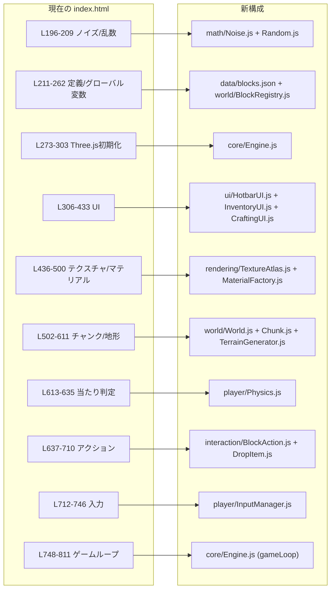
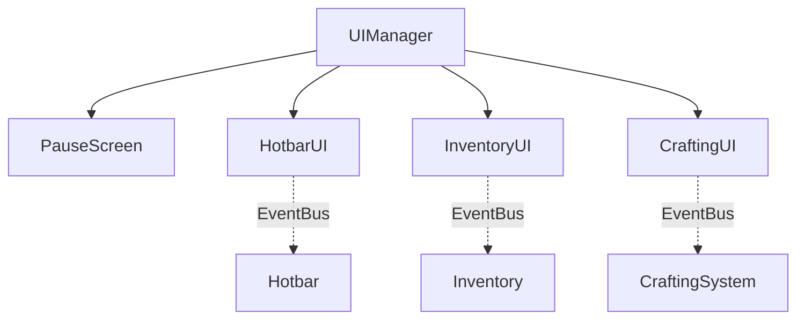
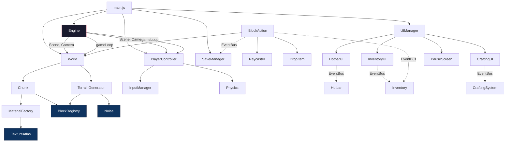

# SURVIVAL VOXEL — コンポーネント化 & ディレクトリ戦略

> [!NOTE]
> 本ドキュメントは [walkthrough.md](file:///c:/Users/tomop/Program/game/minecraft/doc/walkthrough.md) の分析にもとづき、  
> 長期的に機能追加・パフォーマンス改善・チーム開発が行えるプロジェクト構造を提案する。

---

## 1. 設計原則

| 原則           | 説明                                                                         |
| -------------- | ---------------------------------------------------------------------------- |
| **単一責任**   | 1モジュール = 1つの明確な役割。変更理由を1つに限定する                       |
| **疎結合**     | モジュール間は EventBus またはインターフェースで接続し、直接参照を避ける     |
| **データ駆動** | ブロック・レシピ・バイオーム等の定義を JSON/定数に集約し、ロジックと分離する |
| **段階的移行** | 一度に全リファクタリングせず、モジュール単位で段階的に切り出す               |

---

## 2. 提案ディレクトリ構成

```
minecraft/
├── index.html                  # エントリポイント (script type="module" で main.js を読込)
├── vite.config.js              # Vite 設定 (開発サーバー / HMR / バンドル)
├── package.json
│
├── src/
│   ├── main.js                 # アプリケーション起動・初期化オーケストレーション
│   │
│   ├── core/                   # === エンジンコア ===
│   │   ├── Engine.js           # Three.js シーン / カメラ / レンダラー / ゲームループ管理
│   │   ├── EventBus.js         # Pub/Sub によるモジュール間通信
│   │   └── Constants.js        # 全体定数 (CHUNK_SIZE, RENDER_DISTANCE 等)
│   │
│   ├── math/                   # === 数学ユーティリティ ===
│   │   ├── Noise.js            # Perlin ノイズ
│   │   └── Random.js           # LCG / Seeded Random
│   │
│   ├── world/                  # === ワールド管理 ===
│   │   ├── World.js            # チャンク管理 (生成・破棄・座標変換)
│   │   ├── Chunk.js            # 単一チャンクの生成・メッシュ構築・可視判定
│   │   ├── BlockRegistry.js    # ブロック定義データ (ID / 名前 / テクスチャキー / 属性)
│   │   └── TerrainGenerator.js # バイオーム判定・地形高さ・鉱石配置・樹木生成
│   │
│   ├── player/                 # === プレイヤー ===
│   │   ├── PlayerController.js # 移動・ジャンプ・走行の物理演算
│   │   ├── InputManager.js     # キーボード / マウス / ホイール入力の抽象化
│   │   └── Physics.js          # AABB 当たり判定
│   │
│   ├── interaction/            # === ブロック操作 ===
│   │   ├── BlockAction.js      # ブロック破壊・設置ロジック
│   │   ├── Raycaster.js        # 視線先ブロック取得
│   │   └── DropItem.js         # ドロップアイテムの生成・浮遊・吸収
│   │
│   ├── inventory/              # === インベントリ & クラフト ===
│   │   ├── Inventory.js        # 所持アイテム管理
│   │   ├── Hotbar.js           # ホットバー状態 (10スロット)
│   │   └── CraftingSystem.js   # レシピ定義・クラフト実行
│   │
│   ├── rendering/              # === レンダリング ===
│   │   ├── TextureAtlas.js     # プロシージャルテクスチャ生成・キャッシュ
│   │   ├── MaterialFactory.js  # ブロック別マテリアル生成
│   │   └── MeshBuilder.js      # 将来の Greedy Meshing / InstancedMesh 対応
│   │
│   ├── ui/                     # === ゲームUI ===
│   │   ├── UIManager.js        # UI全体の表示切替オーケストレーション
│   │   ├── PauseScreen.js      # ポーズ画面 (操作説明 / ワールドリセット)
│   │   ├── HotbarUI.js         # ホットバー表示・更新
│   │   ├── InventoryUI.js      # インベントリ画面 (D&D 含む)
│   │   └── CraftingUI.js       # クラフトレシピ一覧・作成ボタン
│   │
│   ├── storage/                # === データ永続化 ===
│   │   └── SaveManager.js      # localStorage セーブ / ロード / リセット
│   │
│   └── data/                   # === 静的データ (JSON) ===
│       ├── blocks.json         # ブロック定義 (id, name, iconTex, transparent 等)
│       ├── recipes.json        # クラフトレシピ定義
│       └── biomes.json         # バイオーム定義 (閾値, 表面ブロック, 樹木設定)
│
├── styles/
│   ├── main.css                # CSS変数・ベーススタイル
│   ├── hud.css                 # クロスヘア・ホットバー
│   ├── inventory.css           # インベントリ・クラフト画面
│   └── pause.css               # ポーズ画面
│
├── doc/                        # === ドキュメント ===
│   ├── walkthrough.md
│   └── architecture-strategy.md (本ファイル)
│
└── tests/                      # === テスト (将来) ===
    ├── math/
    ├── world/
    └── inventory/
```

---

## 3. コンポーネント分割マップ

現在の `index.html` の各コード領域が、どのモジュールに移行するかを示す。



---

## 4. 各コンポーネントの責務と公開API設計

### 4.1 `core/Engine.js` — ゲームエンジン本体

```js
export class Engine {
  constructor(canvas)      // Three.js シーン・カメラ・レンダラー初期化
  start()                  // ゲームループ開始
  stop()                   // ゲームループ停止
  onUpdate(callback)       // 毎フレーム呼ばれるコールバックを登録
  getScene()               // Three.js Scene
  getCamera()              // Three.js Camera
}
```

> **ポイント**: ゲームループの `requestAnimationFrame` を Engine が一元管理し、各システムは `onUpdate` でフレーム処理を登録する。

---

### 4.2 `core/EventBus.js` — モジュール間イベント通信

```js
export const EventBus = {
  on(event, handler)       // イベント購読
  off(event, handler)      // 購読解除
  emit(event, data)        // イベント発火
}
```

**主要イベント一覧:**

| イベント名          | 発火元       | データ              |
| ------------------- | ------------ | ------------------- |
| `block:destroyed`   | BlockAction  | `{ pos, type }`     |
| `block:placed`      | BlockAction  | `{ pos, type }`     |
| `item:picked`       | DropItem     | `{ type, count }`   |
| `inventory:changed` | Inventory    | `{ inventory }`     |
| `hotbar:changed`    | Hotbar       | `{ slots, active }` |
| `slot:selected`     | InputManager | `{ index }`         |
| `game:paused`       | UIManager    | —                   |
| `game:resumed`      | UIManager    | —                   |
| `world:save`        | SaveManager  | —                   |

---

### 4.3 `world/` — ワールドシステム

| モジュール            | 責務                                                               |
| --------------------- | ------------------------------------------------------------------ |
| `World.js`            | チャンクの生成・破棄管理。プレイヤー座標からロード範囲を計算       |
| `Chunk.js`            | 16×16 チャンク内のブロックデータ保持・メッシュ構築・可視面カリング |
| `BlockRegistry.js`    | `blocks.json` を読み込み、IDからブロック情報を検索する辞書         |
| `TerrainGenerator.js` | Noise を使った高さマップ・バイオーム判定・鉱石/樹木配置            |

**依存関係:**

```
World → Chunk → TerrainGenerator → Noise + BlockRegistry
                  ↓
              MaterialFactory (メッシュ生成時)
```

---

### 4.4 `player/` — プレイヤーシステム

| モジュール            | 責務                                                                    |
| --------------------- | ----------------------------------------------------------------------- |
| `PlayerController.js` | 移動ベクトル計算・ジャンプ・走行。物理演算の統合                        |
| `InputManager.js`     | 生のキー/マウスイベントを意味ある操作（`moveForward`, `jump` 等）に変換 |
| `Physics.js`          | AABB ベースの衝突検出。`getSolidBlockType` / `checkCollision`           |

> **InputManager の抽象化メリット**: 将来タッチ操作やゲームパッドを追加する際、InputManager のみ拡張すれば PlayerController は無変更。

---

### 4.5 `inventory/` — インベントリ & クラフト

| モジュール          | 責務                                                      |
| ------------------- | --------------------------------------------------------- |
| `Inventory.js`      | アイテム所持数の増減・全アイテム一覧取得                  |
| `Hotbar.js`         | 10 スロットの管理・選択中スロットの切替・D&D によるセット |
| `CraftingSystem.js` | `recipes.json` を読み込み、素材充足チェック・クラフト実行 |

---

### 4.6 `ui/` — UIコンポーネント

各UI　は **ロジックを持たず、状態の表示と操作イベントの発火のみ** を行う。



---

### 4.7 `storage/SaveManager.js` — データ永続化

```js
export class SaveManager {
  save(data)       // { blocks, inventory, hotbar } → localStorage
  load()           // localStorage → パース済みオブジェクト or null
  reset()          // localStorage.removeItem + ページリロード
  enableAutoSave(intervalMs)  // 定期自動セーブ（将来対応）
}
```

---

## 5. データ駆動設計

ハードコードされている定義を JSON に外出しすることで、コードを変更せずにコンテンツを追加可能にする。

### `data/blocks.json` （例）

```json
[
  {
    "id": "grass",
    "name": "草",
    "iconTex": "grass_side",
    "faces": { "top": "grass_top", "bottom": "dirt", "sides": "grass_side" },
    "transparent": false,
    "hardness": 1
  },
  {
    "id": "glass",
    "name": "ガラス",
    "iconTex": "glass",
    "transparent": true,
    "hardness": 0.5
  }
]
```

### `data/recipes.json` （例）

```json
[
  {
    "ingredients": { "cobblestone": 2 },
    "result": { "id": "stone", "count": 1 }
  },
  { "ingredients": { "wood": 1 }, "result": { "id": "planks", "count": 4 } }
]
```

### `data/biomes.json` （例）

```json
[
  {
    "id": "plains",
    "noiseRange": [-0.2, 0.2],
    "surface": "grass",
    "subsurface": "dirt",
    "trees": { "type": "oak", "probability": 0.02 }
  },
  {
    "id": "savanna",
    "noiseRange": [-1.0, -0.2],
    "surface": "dry_grass",
    "subsurface": "dirt",
    "trees": { "type": "acacia", "probability": 0.01 }
  }
]
```

---

## 6. 推奨ビルドツール

| 項目           | 選定                 | 理由                                                       |
| -------------- | -------------------- | ---------------------------------------------------------- |
| バンドラー     | **Vite**             | ゼロコンフィグで ESM の HMR 開発・本番ビルド対応           |
| 言語           | **JavaScript (ESM)** | 現状からの移行コスト最小。将来 TypeScript 化も段階的に可能 |
| リンター       | **ESLint**           | コード品質の自動チェック                                   |
| フォーマッター | **Prettier**         | コードスタイルの統一                                       |

### 最小限の `package.json`

```json
{
  "name": "survival-voxel",
  "private": true,
  "type": "module",
  "scripts": {
    "dev": "vite",
    "build": "vite build",
    "preview": "vite preview"
  },
  "devDependencies": {
    "vite": "^6.x"
  },
  "dependencies": {
    "three": "^0.170.0"
  }
}
```

> [!TIP]
> Vite を導入することで、`import` / `export` による ES Module 分割が即座に使えるようになる。  
> CDN で読み込んでいた Three.js も `npm install three` に移行し、Tree-shaking による軽量化が可能。

---

## 7. 段階的移行ロードマップ

一度に全てをリファクタリングするのではなく、**動作を維持しながら段階的に**切り出す。

### Phase 1 — 基盤構築 & 独立モジュール切り出し

依存が少なく、他に影響を与えないモジュールから着手する。

| ステップ | 内容                                             | リスク |
| -------- | ------------------------------------------------ | ------ |
| 1-1      | Vite プロジェクト初期化・`three` npm化           | 低     |
| 1-2      | `math/Noise.js`, `math/Random.js` を切り出し     | 低     |
| 1-3      | `data/blocks.json`, `data/recipes.json` を外出し | 低     |
| 1-4      | `core/Constants.js`, `core/EventBus.js` を作成   | 低     |
| 1-5      | CSS を `styles/` 配下に分割                      | 低     |

### Phase 2 — ワールド & レンダリング分離

最もコード量が多い領域の分割。

| ステップ | 内容                                               | リスク |
| -------- | -------------------------------------------------- | ------ |
| 2-1      | `rendering/TextureAtlas.js` + `MaterialFactory.js` | 中     |
| 2-2      | `world/BlockRegistry.js` + `TerrainGenerator.js`   | 中     |
| 2-3      | `world/Chunk.js` + `World.js`                      | 中     |

### Phase 3 — プレイヤー & インタラクション

| ステップ | 内容                                                          | リスク |
| -------- | ------------------------------------------------------------- | ------ |
| 3-1      | `player/InputManager.js`                                      | 低     |
| 3-2      | `player/Physics.js` + `PlayerController.js`                   | 中     |
| 3-3      | `interaction/BlockAction.js` + `DropItem.js` + `Raycaster.js` | 中     |

### Phase 4 — インベントリ & UI

| ステップ | 内容                                    | リスク |
| -------- | --------------------------------------- | ------ |
| 4-1      | `inventory/Inventory.js` + `Hotbar.js`  | 低     |
| 4-2      | `inventory/CraftingSystem.js`           | 低     |
| 4-3      | `ui/` 各コンポーネント + `UIManager.js` | 中     |

### Phase 5 — 統合 & 仕上げ

| ステップ | 内容                                       | リスク |
| -------- | ------------------------------------------ | ------ |
| 5-1      | `storage/SaveManager.js`                   | 低     |
| 5-2      | `core/Engine.js` + `main.js` で全体統合    | 高     |
| 5-3      | 旧 `index.html` のインラインコード完全削除 | 高     |

> [!IMPORTANT]
> **各 Phase の最後に必ず動作確認を行うこと。**  
> 特に Phase 5-2 はすべてがつながる統合ポイントであり、最もバグが発生しやすい。

---

## 8. コンポーネント間依存関係図



---

## 9. 命名規則・コーディング規約

| 項目        | 規約                                                        |
| ----------- | ----------------------------------------------------------- |
| ファイル名  | `PascalCase.js`（クラス）/ `camelCase.js`（ユーティリティ） |
| クラス名    | `PascalCase`                                                |
| 関数・変数  | `camelCase`                                                 |
| 定数        | `UPPER_SNAKE_CASE`                                          |
| イベント名  | `category:action`（例: `block:destroyed`）                  |
| JSON データ | `kebab-case.json`                                           |
| CSS クラス  | `kebab-case`（既存スタイルを踏襲）                          |

---

## 10. 将来の拡張に向けた設計ポイント

| 拡張項目                 | 対応するコンポーネント                        | 設計上の考慮                      |
| ------------------------ | --------------------------------------------- | --------------------------------- |
| **新ブロック追加**       | `data/blocks.json` に1行追加 + テクスチャ定義 | データ駆動なのでコード変更不要    |
| **新レシピ追加**         | `data/recipes.json` に1行追加                 | 同上                              |
| **Greedy Meshing**       | `rendering/MeshBuilder.js` を差し替え         | Chunk.js のメッシュ構築を委譲済み |
| **InstancedMesh**        | `rendering/MeshBuilder.js`                    | 同上                              |
| **昼夜サイクル**         | `core/Engine.js` にライト制御追加             | Engine が光源を一元管理           |
| **サウンド**             | 新規 `audio/SoundManager.js`                  | EventBus でブロック破壊等に反応   |
| **モブ（エンティティ）** | 新規 `entity/` ディレクトリ                   | World と Physics に依存           |
| **マルチプレイ**         | 新規 `network/` ディレクトリ                  | EventBus を WebSocket に橋渡し    |
| **TypeScript 化**        | `.js` → `.ts` に順次変換                      | Vite は TS を標準サポート         |
