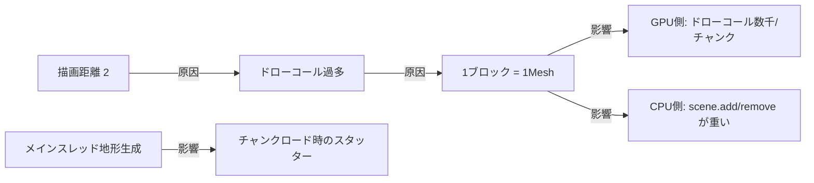

# パフォーマンス改善計画 — 描画チャンク数拡大

## 現状分析

### 現在の構成

| 項目           | 値                         | 備考                           |
| -------------- | -------------------------- | ------------------------------ |
| 描画距離       | **2チャンク**              | 5×5 = 25チャンクがロード対象   |
| チャンクサイズ | 16×16 (Y: -50 ~ 地表)      | 約70ブロック高                 |
| メッシュ方式   | **ブロック1個 = Mesh 1個** | THREE.Mesh × 数千/チャンク     |
| 地形生成       | メインスレッド (同期)      | チャンク移動時にスタッター発生 |
| ジオメトリ     | 共有BoxGeometry 1個        | 良い                           |
| マテリアル     | ブロック種別ごとに共有     | 良い                           |
| 可視面カリング | 6方向隣接チェック          | 内部ブロックは生成しない       |

### 主要ボトルネック

**最大の問題: 1ブロック = 1 THREE.Mesh**

- 描画距離2（25チャンク）でも、可視ブロック数は **数万〜10万個**。
- GPUへのドローコールが1ブロックごとに発生し、WebGL の限界に達する。
- `scene.add()` / `scene.remove()` のオーバーヘッドも大きい。

---

## 改善フェーズ

### Phase 1: Greedy Meshing (効果: ★★★★★)

> 最も効果が大きい。ドローコール数を **チャンクあたり数千 → 数個** に削減。

#### 概要

チャンク内の同一ブロック種の**露出面**を統合し、1チャンク = ブロック種ごとに1つの `BufferGeometry` にまとめる。

#### 実装方針

1. **`Chunk.js` の `buildMeshes()` を全面リライト**
   - ブロック種別ごとに頂点 / UVバッファを構築
   - 隣接ブロックが同種の場合、面を統合 (Greedy Meshing)
   - `THREE.Mesh` ではなく `THREE.BufferGeometry` + `THREE.Mesh` を使用
   - **1チャンク = マテリアル数分の Mesh** に削減

2. **面カリングの改良**
   - 6方向隣接チェックを面単位で実行
   - 不透明ブロックの埋没面を完全にスキップ

3. **Raycaster の対応**
   - `intersectObjects` の結果から `face.materialIndex` でブロック種を逆引き
   - 頂点位置からワールド座標を復元

#### 期待効果

| 指標                   | Before              | After    |
| ---------------------- | ------------------- | -------- |
| ドローコール/チャンク  | ~3000               | **~10**  |
| ジオメトリオブジェクト | ~75000 (25チャンク) | **~250** |
| VRAM使用量             | 高                  | 中       |
| 描画距離限界           | 2                   | **6–8**  |

---

### Phase 2: Web Worker 非同期チャンク生成 (効果: ★★★★☆)

> チャンク移動時のフレーム落ちを解消。

#### 概要

地形生成 + メッシュデータ構築を **Web Worker** で行い、メインスレッドは結果のバッファを受け取るだけにする。

#### 実装方針

1. **`ChunkWorker.js` を新規作成**
   - Worker 内で `TerrainGenerator` と `Greedy Meshing` を実行
   - 結果を `Float32Array`（頂点/UVバッファ）で `postMessage`
   - `Transferable` で転送 (コピーコスト0)

2. **`World.js` を修正**
   - `_generateChunk()` を Worker に委託
   - Worker 完了コールバックでメインスレッドの `BufferGeometry` にセット
   - ロード中プレースホルダ (任意)

3. **ワーカープール**
   - `navigator.hardwareConcurrency` ベースで 2–4 Worker を並列運用
   - チャンク生成キューで優先度管理（近いチャンクを先に）

#### 期待効果

| 指標                         | Before   | After            |
| ---------------------------- | -------- | ---------------- |
| チャンクロード時のスタッター | 50–200ms | **0ms** (非同期) |
| FPS安定性                    | 変動大   | 安定             |

---

### Phase 3: LOD (Level of Detail) (効果: ★★★☆☆)

> 遠方チャンクの頂点数を削減し、超遠距離描画を可能にする。

#### 概要

プレイヤーからの距離に応じて、チャンクの詳細度を段階的に下げる。

#### 実装方針

| 距離          | LOD   | 内容                                      |
| ------------- | ----- | ----------------------------------------- |
| 0–3 チャンク  | LOD 0 | フル詳細 (Greedy Meshing)                 |
| 4–6 チャンク  | LOD 1 | 2×2×2 ブロック単位で統合                  |
| 7–10 チャンク | LOD 2 | 4×4 列の最高点のみ描画 (地形のシルエット) |

1. **`Chunk.js` に LOD レベル別ビルド関数を追加**
   - `buildMeshes(lod)` で LOD を指定
   - LOD 1: 2×2×2 を1ブロックに集約 (多数派ブロック種を採用)
   - LOD 2: ハイトマップベースのシンプルな板ポリゴン

2. **`World.js` に LOD 管理を追加**
   - チャンク距離に応じて LOD を自動選択
   - プレイヤー移動時に LOD 遷移 (近づいたら詳細化)

#### 期待効果

| 指標                 | Before        | After     |
| -------------------- | ------------- | --------- |
| 描画距離限界         | 6–8 (Phase 1) | **12–16** |
| 遠方描画のポリゴン数 | 100%          | 5–10%     |

---

### Phase 4: Frustum Culling 強化 & InstancingMesh (効果: ★★☆☆☆)

> 追加の最適化。Phase 1 と組み合わせて効果を発揮。

#### 実装方針

1. **チャンク単位の Frustum Culling**
   - カメラの視錐台外のチャンクメッシュを `.visible = false` に
   - 背面のチャンクは描画スキップ

2. **フォグ距離の動的調整**
   - 描画距離に合わせて `FOG_NEAR` / `FOG_FAR` を自動調整

---

## 実装優先度

```mermaid
gantt
  title 実装ロードマップ
  dateFormat X
  axisFormat %s
  section Phase 1
    Greedy Meshing           :a1, 0, 3
    Raycaster対応            :a2, after a1, 1
  section Phase 2
    Web Worker               :b1, after a2, 2
    ワーカープール            :b2, after b1, 1
  section Phase 3
    LOD Level 1              :c1, after b2, 1
    LOD Level 2              :c2, after c1, 1
  section Phase 4
    Frustum Culling          :d1, after c2, 1
```

> [!IMPORTANT]
> **Phase 1 (Greedy Meshing)** が最も効果が大きく、他の全ての改善の基盤になる。
> まずPhase 1を優先的に実装し、描画距離を2→6–8に拡大してから他のフェーズに移ることを推奨。

## 想定される描画距離の変化

| フェーズ         | 描画距離 | チャンク数 | 60FPS維持可能か |
| ---------------- | -------- | ---------- | --------------- |
| 現状             | 2        | 25         | ⚠ ギリギリ      |
| Phase 1 完了     | 6–8      | 169–289    | ✅              |
| Phase 1+2 完了   | 6–8      | 169–289    | ✅ (安定)       |
| Phase 1+2+3 完了 | 12–16    | 625–1089   | ✅              |

## 変更対象ファイル

| ファイル                       | Phase   | 変更内容                      |
| ------------------------------ | ------- | ----------------------------- |
| `src/world/Chunk.js`           | 1, 3    | メッシュ構築全面リライト、LOD |
| `src/world/World.js`           | 2, 3, 4 | Worker委託、LOD管理、Frustum  |
| `src/interaction/Raycaster.js` | 1       | BufferGeometry対応            |
| `src/world/ChunkWorker.js`     | 2       | 新規: Worker                  |
| `src/core/Constants.js`        | 1       | RENDER_DISTANCE 変更          |
| `src/core/Engine.js`           | 4       | フォグ動的調整                |
