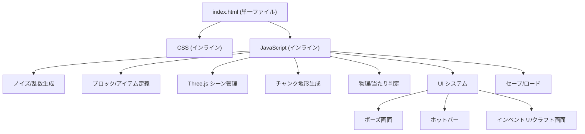

# SURVIVAL VOXEL プロジェクト概要ドキュメント

> [!NOTE]
> 最終調査日: 2026-02-21 | ファイル: [index.html](file:///c:/Users/tomop/Program/game/minecraft/index.html) (814行 / 約55KB)

## プロジェクト概要

**Minecraft風のボクセルサバイバルゲーム**を、単一のHTMLファイルで実装したブラウザゲーム。  
Three.jsを用いた3Dレンダリング、チャンク制の無限地形生成、クラフトシステム、インベントリ管理を備える。

---

## 技術スタック

| カテゴリ | 技術 |
|---|---|
| 3Dエンジン | **Three.js r128** (CDN) |
| カメラ制御 | **PointerLockControls** |
| フォント | Montserrat, Noto Sans JP (Google Fonts) |
| データ永続化 | **localStorage** |
| ビルドツール | なし（バニラHTML/CSS/JS） |

---

## アーキテクチャ

---

## 実装済み機能

### 🌍 ワールド生成
- **Perlinノイズ**ベースの地形生成（LCGシードによる再現性あり）
- **チャンクシステム**: 16×16ブロック単位、描画距離2チャンク
- **4種のバイオーム**: 平原 / サバンナ / 山岳 / 雪原
- **樹木生成**: 通常の木（平原）、アカシアの木（サバンナ）
- **鉱石分布**: 石炭 / 鉄 / 金 / ダイヤモンド（深度に応じた出現率）
- **水面・氷**: 水位ゼロ基準、雪原バイオームでは氷に変化

### 🧱 ブロックタイプ (21種)

| カテゴリ | ブロック |
|---|---|
| 自然 | 草、土、砂、石、雪 |
| 木材 | 原木、アカシア木、葉、アカシア葉 |
| 鉱石 | 石炭、鉄、金、ダイヤモンド |
| クラフト品 | 丸石、板材、ガラス、レンガ、本棚、黒曜石、氷 |
| 流体 | 水（半透明、設置不可） |

### 🎮 プレイヤー操作
- **WASD移動** + **Shift走り** + **Spaceジャンプ**
- **左クリック**: ブロック破壊 & アイテムドロップ
- **右クリック**: ブロック設置（プレイヤー位置への重複防止）
- **マウスホイール / 数字キー**: ホットバーアイテム切替
- **Eキー**: インベントリ/クラフト画面の切替

### 🔨 クラフトシステム (9レシピ)

| 素材 | → | 成果物 |
|---|---|---|
| 丸石 ×2 | → | 石 ×1 |
| 砂 ×2 | → | ガラス ×1 |
| 土 ×2 | → | レンガ ×1 |
| 原木 ×1 | → | 板材 ×4 |
| アカシア木 ×1 | → | 板材 ×4 |
| 板材 ×3 + 葉 ×1 | → | 本棚 ×1 |
| 土 ×2 + 葉 ×1 | → | 草 ×1 |
| 雪 ×2 | → | 氷 ×1 |
| 石 ×4 + 石炭 ×1 | → | 黒曜石 ×1 |

### 🎨 レンダリング
- **プロシージャルテクスチャ**: Canvas 16×16ピクセルで全テクスチャを動的生成
- **可視面カリング**: 隣接ブロックに囲まれたブロックは非表示
- **半透明ブロック対応**: 水、葉、ガラス、氷
- **フォグ**: 遠景を空色でフェードアウト

### 🖥️ UI
- **ポーズ画面**: 操作説明 + ワールドリセットボタン
- **ホットバー**: 10スロット、アイコン＋所持数表示
- **インベントリ画面**: 全アイテム一覧（D&Dでホットバーにセット可能）
- **クラフト画面**: 素材充足状況のリアルタイム表示
- **グラスモーフィズムUI**: 半透明パネル + ブラー効果

### 💾 データ永続化
- `localStorage` に JSON 形式でセーブ
- 保存内容: ブロック変更差分 / インベントリ / ホットバー構成

---

## コード構成 ([index.html](file:///c:/Users/tomop/Program/game/minecraft/index.html))

| 行範囲 | 内容 |
|---|---|
| [1-146](file:///c:/Users/tomop/Program/game/minecraft/index.html#L1-L146) | HTML構造 + CSS + 外部CDN読み込み |
| [196-209](file:///c:/Users/tomop/Program/game/minecraft/index.html#L196-L209) | 乱数・Perlinノイズ |
| [211-262](file:///c:/Users/tomop/Program/game/minecraft/index.html#L211-L262) | ブロック/アイテム定義・グローバル変数・セーブ復元 |
| [273-303](file:///c:/Users/tomop/Program/game/minecraft/index.html#L273-L303) | 初期化 (Three.js セットアップ) |
| [306-433](file:///c:/Users/tomop/Program/game/minecraft/index.html#L306-L433) | UI (ツールバー・インベントリ・クラフト) |
| [436-500](file:///c:/Users/tomop/Program/game/minecraft/index.html#L436-L500) | テクスチャ/マテリアル生成 |
| [502-611](file:///c:/Users/tomop/Program/game/minecraft/index.html#L502-L611) | チャンク・地形生成 |
| [613-635](file:///c:/Users/tomop/Program/game/minecraft/index.html#L613-L635) | 当たり判定 |
| [637-710](file:///c:/Users/tomop/Program/game/minecraft/index.html#L637-L710) | アクション (破壊・設置・セーブ) |
| [712-746](file:///c:/Users/tomop/Program/game/minecraft/index.html#L712-L746) | キーボード/マウス入力 |
| [748-811](file:///c:/Users/tomop/Program/game/minecraft/index.html#L748-L811) | メインループ (物理・ドロップ回収) |

---

## 改善の余地がある点

| 分野 | 現状の課題 |
|---|---|
| **パフォーマンス** | 各ブロックが個別Meshオブジェクト → **InstancedMesh** や **Greedy Meshing** で大幅改善可能 |
| **描画距離** | RENDER_DISTANCE=2 は狭い。メッシュ結合後に拡大可能 |
| **コード構造** | 全コードが1ファイル → モジュール分割でメンテナンス性向上 |
| **テクスチャ** | プロシージャル生成は軽量だがクオリティに限界。テクスチャアトラス画像の導入も検討 |
| **サウンド** | 効果音・BGMが未実装 |
| **モバイル対応** | タッチ操作に非対応 |
| **ライティング** | 昼夜サイクル・光源ブロック（松明等）が未実装 |
| **エンティティ** | Mob（動物・敵）が不在 |
